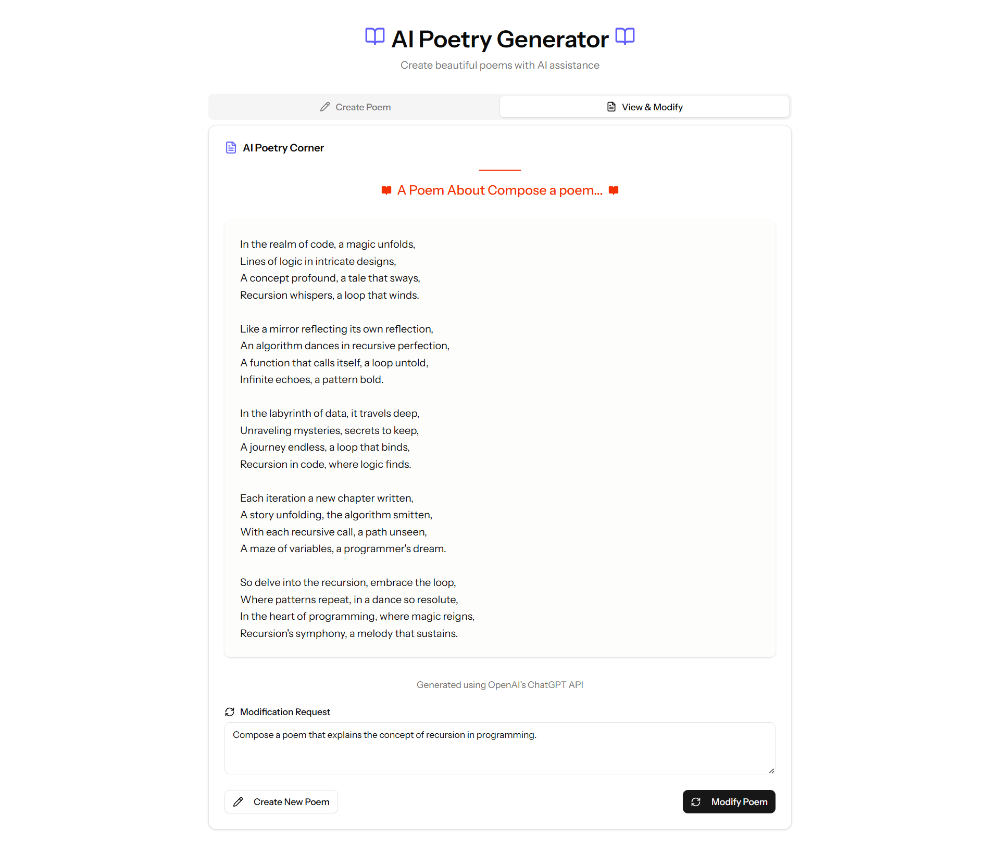
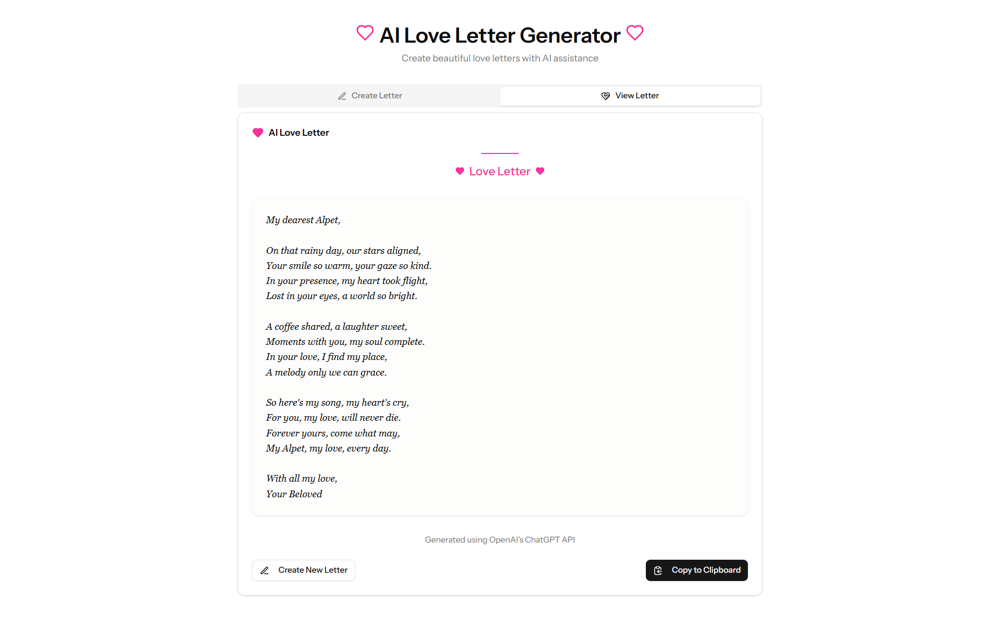
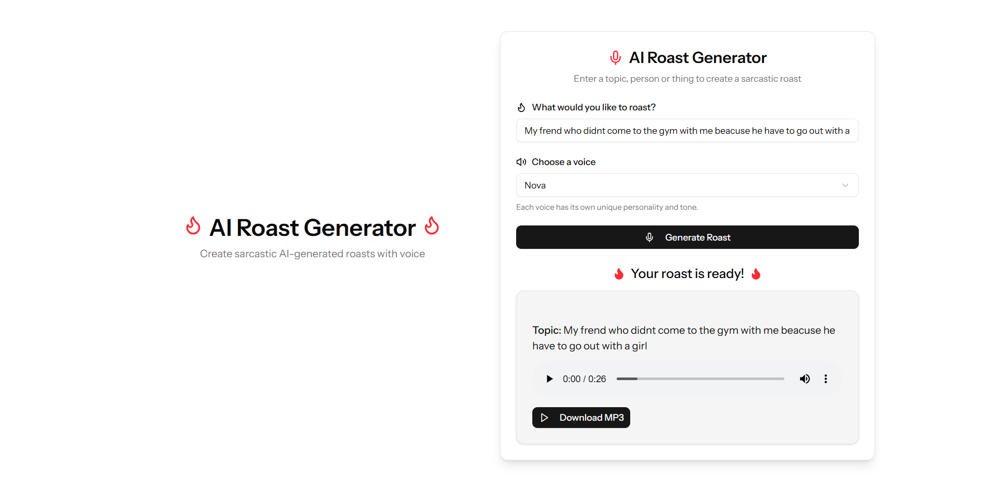
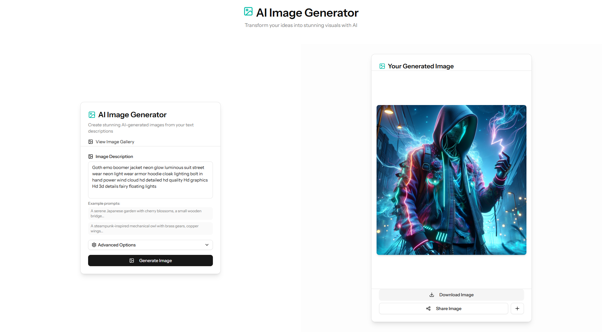
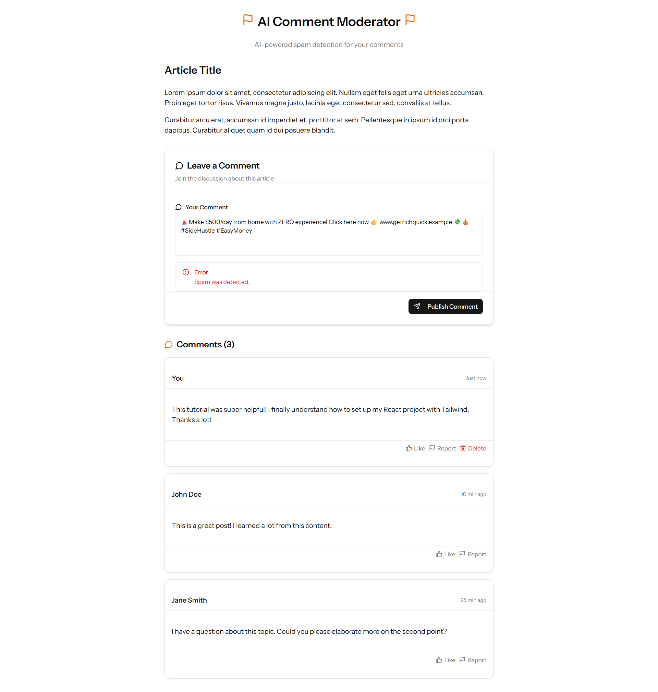
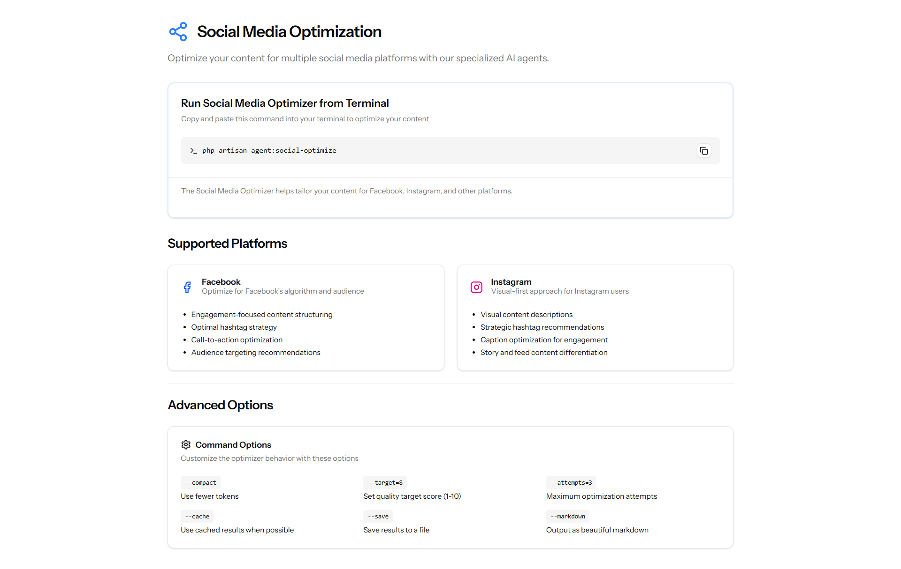
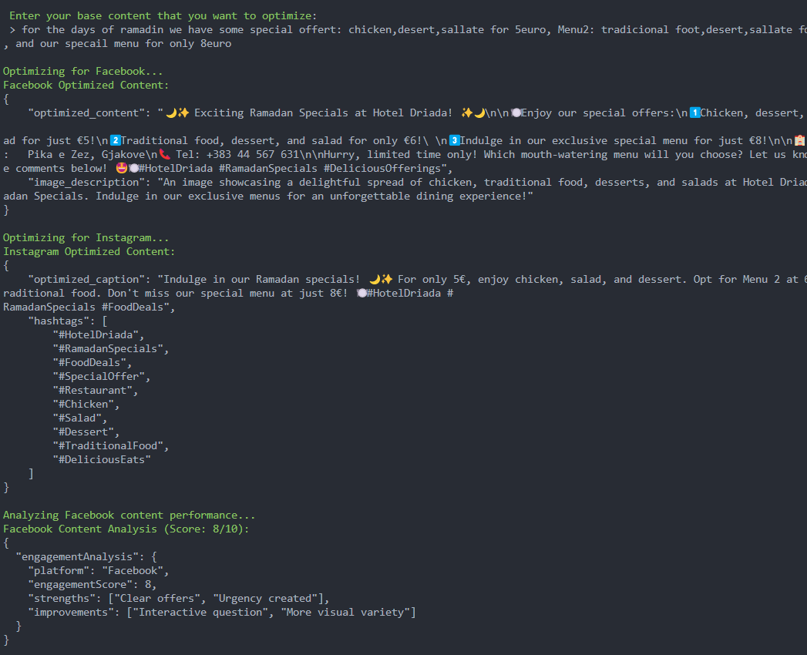

# AI Playground: Laravel & OpenAI Integration Suite


## Overview

AI Playground is a feature-rich web application that demonstrates the power and versatility of AI integration within Laravel applications. Built using Laravel as the backend framework and React (via Inertia.js) for the frontend, this project serves as both a practical toolkit and a showcase of OpenAI's capabilities when seamlessly integrated into a modern web application.


## Features

The application includes multiple AI-powered tools and features:

### Interactive AI Chat

- Real-time chat with AI assistant using Server-Sent Events (SSE) for streaming responses
- Todo integration: create and manage todos through natural language commands
- Built with OpenAI's GPT models using the Prism PHP package for enhanced interactions

### Image Generation

- AI-powered image creation from text descriptions using DALL-E
- Image gallery for browsing and managing generated images

### Creative Content Generation

- **Poem Generator**: Create and modify custom poems on any topic



- **Love Letter Generator**: Generate personalized love letters with customizable tone, length, and style



- **Roast Generator**: Create humorous roasts with text-to-speech capability



<audio controls>
    <source src="public/roast/1747105330-jxAiLxM.mp3" type="audio/mpeg">
    Your browser does not support the audio element.
</audio>

### Image Generation

- AI-powered image creation from text descriptions using DALL-E
- Image gallery for browsing and managing generated images



### Todo Task Management Assistant

- Create and manage todos through natural language commands
- Add, edit, and delete tasks with ease
- View tasks in a user-friendly interface


#### Results


### Content Analysis

- **Spam Detection**: AI-powered comment validation using custom Laravel validation rules
- Intelligent content analysis for various use cases



## Multi Agent System

### Social Media Optimization

- Multi-platform content optimization for Facebook and Instagram
- Business-specific customization for the hotel and restaurant industry
- Analytics and engagement potential assessment
- Specialized AI agents for different platforms

READ MORE HERE : [Social Media Optimization](SOCIAL_MEDIA_README.md)




### Advanced AI Architecture

- Multi-agent system with specialized AI agents:
  - Facebook Agent
  - Instagram Agent
  - YouTube Agent
  - Analytics Agent
  - Content Optimizer Agent
- Console commands for social media optimization

## Youtube Video Analysis

- AI-powered video analysis for YouTube content
- Generate video descriptions, titles, and tags
- Analyze video performance and engagement potential

## Technology Stack

- **Backend**: Laravel 12+
- **Frontend**: React with Inertia.js, Typescript, and Tailwind CSS/Shadcn UI
- **AI Integration**: OpenAI API (GPT-3.5/4, DALL-E), Prism PHP package
- **Streaming**: Server-Sent Events (SSE) for real-time AI responses

## Prerequisites

- PHP 8.2+
- Composer
- Node.js & npm
- OpenAI API key
- Laravel requirements (BCMath, Ctype, JSON, etc.)

### More details generated by AI


## Installation

Clone the repository:

```bash
git clone https://github.com/AlpetGexha/ai-playground
cd ai-playground
cp .env.example .env
composer install
php artisan key:generate
npm install
```

Becuse the OpenAI requires to use the SSL (https), you need to install the SSL certificate manuily.

Or u can use the **Herd**

in your project directory, run:

```bash
herd link
herd secure
```

Add the key to your `.env` file:

```bash
OPENAI_API_KEY=your_api_key_here
OPENAI_ORGANIZATION=your_organization_id_here
```

## Project Structure

Key directories and files:

- `app/Http/Controllers/AI/`: Contains controllers for all AI features
- `app/Agents/`: Houses the specialized AI agents for different platforms
- `app/Services/`: Contains the ChatAI service and other utility services
- `resources/js/pages/`: React components for each page of the application
- `routes/web.php`: Defines all web routes for accessing features
- `config/openai.php`: Configuration for OpenAI integration

## Security Considerations

- The application stores API keys in the `.env` file (never commit this to public repositories)
- Implement proper user authentication to restrict access to AI features
- Consider implementing rate limiting for API requests to control costs

## Understanding AI Roles

The application uses three primary roles in AI interactions:

- **System**: Defines the behavior and parameters of the AI assistant
- **User**: Represents input from the human user
- **Assistant**: Represents responses from the AI

## Useful Links

- [OpenAI PHP for Laravel](https://github.com/openai-php/laravel)
- [Prism PHP Package](https://github.com/prism-php/prism)
- [OpenAI Platform](https://platform.openai.com/settings/organization/general)
- [OpenAI API Keys](https://platform.openai.com/settings/organization/api-keys)
